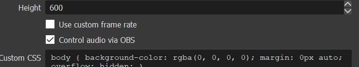

# LocalCustomAnimation

A file for loading a custom animation

Usage:
Place the wrapper.html and the test.js in the same folder along with your animation and optional sound file. Rename the animation as alert_animation and the sound file as alert_sound.

Within the HTML file "wrapper.html" Ensure that you change the filetype for your video and audio as follows:

If your video is MP4 instead of webm change these lines:
`        <!-- EDIT ONLY BELOW IF THE ANIMATION IS NOT A WEBM -->
        <source src="alert_animation.webm" type="video/webm">
        <!-- ONLY EDIT ABOVE -->`
To look like :
`        <!-- EDIT ONLY BELOW IF THE ANIMATION IS NOT A WEBM -->
        <source src="alert_animation.mp4" type="video/mpeg">
        <!-- ONLY EDIT ABOVE -->`

and if your audio is mp3 instead of m4a change these lines:
`        <!-- EDIT ONLY BELOW IF AUDIO IS NOT m4a -->
        <source src="alert_sound.m4a" type="audio/mpeg">
        <!-- ONLY EDIT ABOVE -->`
to look like this:
`        <!-- EDIT ONLY BELOW IF AUDIO IS NOT m4a -->
        <source src="alert_sound.mp3" type="audio/mpeg">
        <!-- ONLY EDIT ABOVE -->`

Within OBS or Streamlabs create a new browser source and select the box that says Local File:

then select the wrapper.html as the local file.

Then ensure that the two checkboxes are checked:

* Shutdown source when not visible
* Refresh browser when scene becomes active

Next, to be able to hear the alert go off if there is a sound:

* Ensure that the "Control audio via OBS" checkbox is checked within the source properties as well
* 
* Go into the Sources advanced audio properties:
* 
* Ensure that the dropdown on the far right reads: "Monitor and Output"
* 
* If you dont see it in the list ensure the source is visible first and try again.

Now when the alert goes off you should be able to hear it

Test it out by hiding and showing the source.

Now hide the source and go to Streamer.bot.

Within Streamer.bot Create 2 Actions:

1. a new action that changes the contents of test.js  using the format:
   *var latest = "Text goes here";*
   to the latest event text and then call action 2
2. and then create another action which

* Shows the source you just made
* Add a delay that allows the animation to complete playing
* Hide the source.

3. Go to the events tab and select Action 1 as the action to occur when the desired event occurs.
